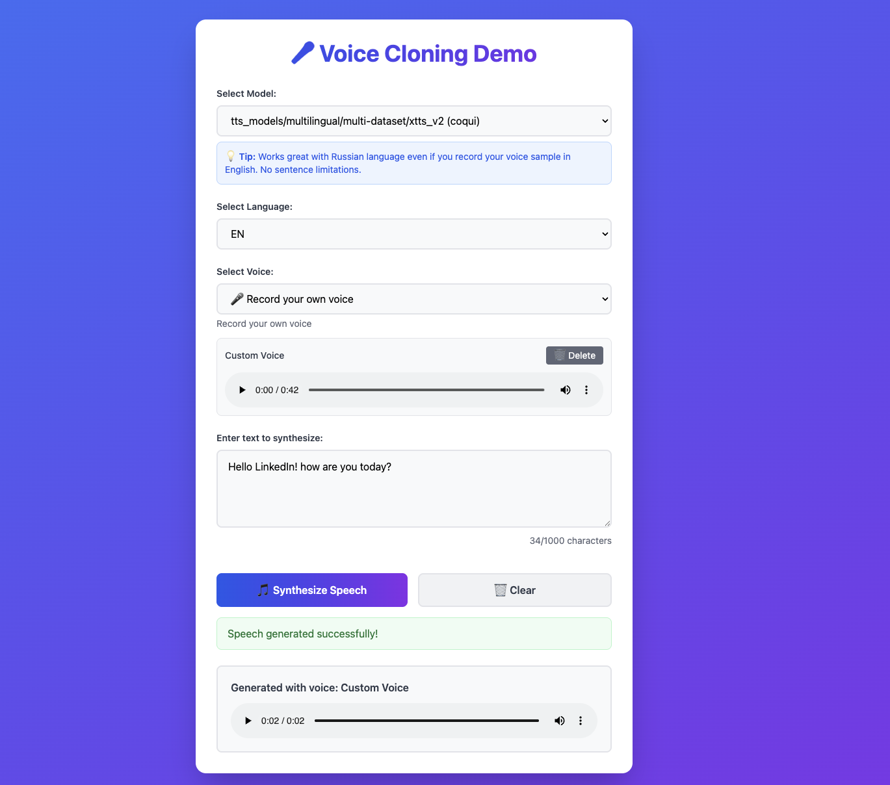

# Voice Cloning Demo

## ⚠️ Disclaimer

**Use Responsibly**: This project is provided for educational and research purposes only. The author makes no claims and assumes no liability for any misuse of this technology. 

**Important**: It is illegal and unethical to clone someone's voice without their explicit permission. Always obtain proper consent before using someone's voice data. Misuse of voice cloning technology can lead to serious problems.

**NOTE**: This is a proof-of-concept demonstration, not a production-ready solution. The goal is to showcase voice cloning capabilities running on CPU in Docker. I was testing this on Macbook Air M1 with 16 GB RAM

## Overview

A multi-worker TTS system with isolated workers for different models, managed by supervisord in a single container.

To run the app, you might need to wait around 3-10 minutes for initial setup and then each voice generation can take another 3-10 minutes. This is a demo running on CPU only with no GPU support. 

## Demo



## Architecture

- **Gateway** (FastAPI): Handles HTTP requests and job distribution
- **Coqui Worker** (Coqui TTS): High-quality voice cloning with numpy 1.22
- **NeuTTS Worker** (neuTTS): Advanced voice synthesis with numpy 2.x
- **Communication**: File-based job queues in `/tmp`

## Available Engines

* Coqui - https://docs.coqui.ai/en/latest/index.html
* NeuTTS - https://github.com/neuphonic/neutts-air

## Quick Start

### Docker (Recommended)

```bash
docker-compose up --build

# or

docker compose up --build
```

App will be available at: http://localhost:8000

### Environment Variables

Control which workers are enabled:

```bash
# Enable all workers (default)
ENABLED_WORKERS=coqui,neutts

# Enable only Coqui
ENABLED_WORKERS=coqui

# Enable only NeuTTS
ENABLED_WORKERS=neutts
```

Also if you are disabling some of the workers - comment the appropriate section in supervisord.conf

## Requirements

- Python 3.10+
- 8GB RAM (for model loading)
- Docker / Docker Compose
